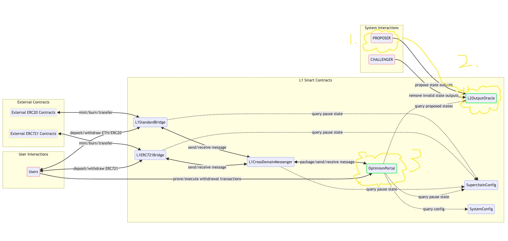

# 第一章：What is Fault Proof

## 第一节：我们为什么需要 Fault Proof

在深入了解 Fault Proof 之前，首先考虑一下为什么需要 Fault Proof，它解决了哪些关键问题？

## 在 Fault Proof 引入之前的 Optimism 机制

想象一下，一笔提现交易需要从 L2 发出并成功从 L1 提现，这个过程中间经历了哪些关键步骤？

1. 用户在 L2 发起提现交易 a。
2. 交易 a 被包含在区块中。
3. 该区块被确认为 finalized。
4. 提案者将区块的 state outputs 发送至 L1 的 L2OutputOracle 合约。
5. Portal 合约查询 L2OutputOracle 合约中的 state outputs，确认用户在 L2 中确实发起了有效的提现交易。
6. 用户成功提现。

关键角色包括：Proposer、L2OutputOracle 和 Portal 合约。请参考下图。




分析这些角色，哪些是由 Optimism 单方面负责运营的中心化角色？

Proposer 和 L2OutputOracle 两者配合，负责 L2 的 state outputs 在 L1 上的正常传输。由于其他人无法参与这一过程，如果 Proposer 作恶或宕机，其影响极大。因此，我们急需一种高度去中心化的解决方案，让所有人都能参与进来。

## Fault Proof 如何完美解决这一问题

通过引入 Fault Proof，任何人都能提出和校验某个区块的 state outputs。可以说，Fault Proof 的引入是为了更有效地在 L1 进行必要的验证，以确保 L2 state outputs 的准确传递。

# 第二节：什么是 Fault Proof

上一节我们探讨了 Fault Proof 的必要性。本节将主要介绍 Fault Proof 的基本原理和组成。

## Fault Proof 设计概述

在深入探讨正式的 Fault Proof 机制和角色之前，我们首先尝试设计一个简单的 Fault Proof 模型。设计要求如下：
1. 可以通过链上的 Portal 合约查询到 state。
2. 任何人都可以参与。
3. 可以纠正错误的 state。

### 初步设计

基于这些要求，我们可以设计如下简易的链上智能合约：

```solidity

contract SimpleFPContract {
    bytes32 public state;

    function setState(bytes32 _state) public {
        state = _state;
    }
}

```

然而，此设计存在一个问题：state 可以被任意修改。尽管维护者可能每次都会纠正错误的 state，但这种方法仍然有显著的不足。那么如何改进呢？我们是否可以引入一个法官角色来判定结果？不幸的是，如果只引入一个法官，这个角色将像之前的 Proposer 一样拥有绝对权力。

因此，我们不妨抽象出法官的审判逻辑，并在链上实现类似法官的判决过程？

### 抽象出来的审批逻辑及设计

在出现 state 争议时，法官通常会介入，重新执行 L2 的所有交易直至重新计算出最终的 state，并将其与争议方提出的 state 进行比较，以判定正确的一方。我们可以通过在链上实现一个类似 [MIPS](https://www.linux-mips.org/wiki/Syscall) 虚拟机的智能合约来模拟这一过程。当争议发生时，只需执行链上的 MIPS 虚拟机来获取正确的 state。

但这种方法是否完美？答案是否定的，因为在链上执行这整套逻辑的成本极高，可能消耗的 gas 费用远超过 1000 个 ETH，这显然是不可接受的。

### 进一步优化的设计

那么，如何在保证链上判断的同时将成本降至最低呢？分析造成 state 争议的根本原因，我们发现，通常是因为在某个操作指令执行时出现了错误，导致后续所有计算产生偏差。因此，我们只需要定位到错误发生的具体位置即可。

让我们考虑让争议双方互相验证各自的指令，直到发现不一致点。但这种方法效率低下。我们可以尝试每隔 100 个或 1000 个指令进行一次检查，但这仍然效率不高。在这种情况下，什么查找方法可以最快地找出不同点？

答案是使用二分法！

通过二分法，我们可以快速定位双方意见分歧的根源，并将这一过程集成到链上智能合约中。

### 设计反馈

在上述步骤中，我们设计了一个初步的 Fault Proof 模型，但仍有许多问题待解。接下来，我们将详细介绍 Fault Proof 的各个组成部分，并在后续章节中比较我们的初步设计与正式的 Fault Proof 之间的差异，以及正式版本解决了哪些我们尚未考虑到的问题。

## Fault Proof 的组成部分

Fault Proof 主要由以下几大部分组成，详细介绍将在下个章节进行。

### [Fault Proof Interactive Dispute Game](https://github.com/ethereum-optimism/specs/blob/main/specs/fault-proof/index.md#fault-proof-interactive-dispute-game)
这部分主要负责链上实现确定最小不同指令集的二分实现。与我们上述的二分法寻找不同点类似，但具有更多细节。例如，在我们的设计中，二分法必须进行到最底层，即找到错误点，并进行链上虚拟机验证。而 Fault Proof Interactive Dispute Game 加入了棋钟等机制，以便在二分搜索过程中，一方如果认识到自己的错误，可以及时停止，避免不必要的 gas 消耗。

### [Fault Proof VM](https://github.com/ethereum-optimism/specs/blob/main/specs/fault-proof/index.md#fault-proof-vm)
我们链上实现的指令虚拟机，例如 CANNON（MIPS 虚拟机）。这是一个模拟后端逻辑的智能合约，可以在发生数据争议时通过执行虚拟机代码来验证和确认正确的 state。

### [Fault Proof Program](https://github.com/ethereum-optimism/specs/blob/main/specs/fault-proof/index.md#fault-proof-program)
这是争议双方执行所有事物，如攻击或防守的客户端程序。它负责协调整个争议解决过程，确保双方在链上公平对抗。

### [Pre-image Oracle](https://github.com/ethereum-optimism/specs/blob/main/specs/fault-proof/index.md#fault-proof-interactive-dispute-game)
在执行到最细颗粒级别时，此角色提供必要的数据源。当涉及到需要验证的具体数据时，Pre-image Oracle 能够提供可靠的信息来源，以支持争议解决过程。

### [OP-Challenger](https://github.com/ethereum-optimism/optimism/blob/develop/op-challenger/README.md)
OP-Challenger 是一个操作栈挑战代理，用于争议游戏，包括但不限于证明游戏、故障游戏和有效性游戏。它是直接调用 Program 或 Dispute Game 的服务，包含自动监听链上事件的功能，触发攻击或防守程序。此代理能够有效地协调链上和链下资源，优化整个争议解决流程。

通过以上各个组成部分的协同工作，Fault Proof 能够有效地处理和解决链上数据的正确性问题，提供一个去中心化且高效的验证机制。下一章节将详细探讨这些组件如何具体协同操作，并通过案例分析展示 Fault Proof 在实际操作中的应用效果。