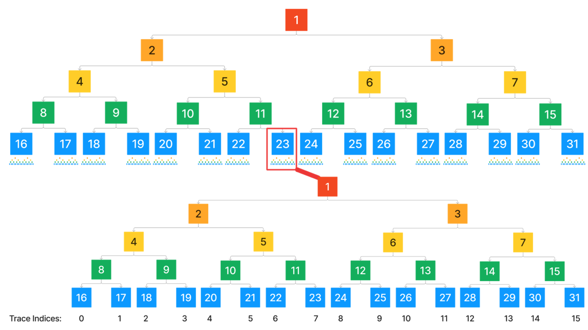
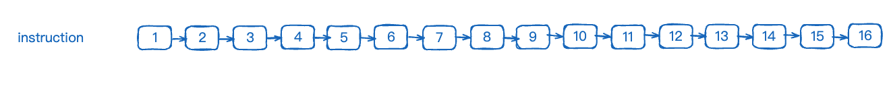
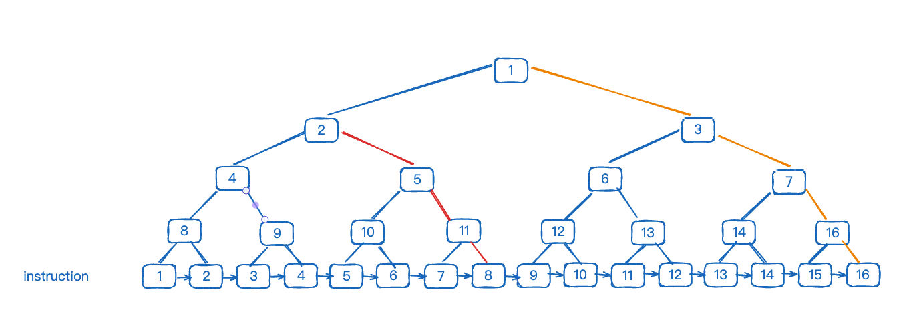
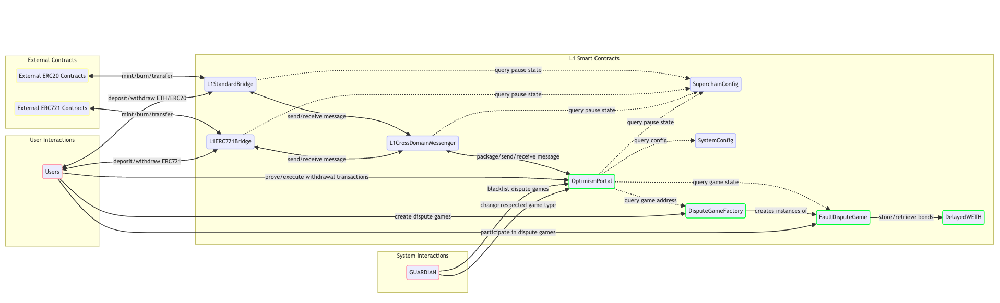
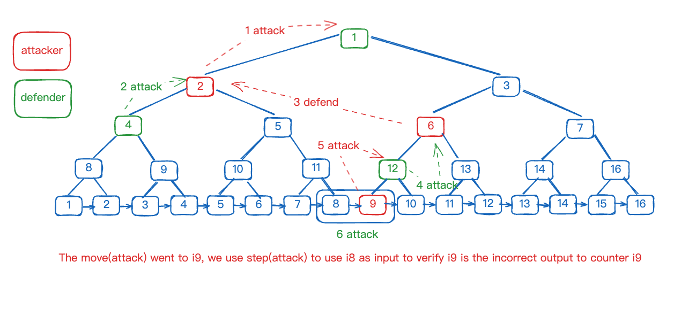
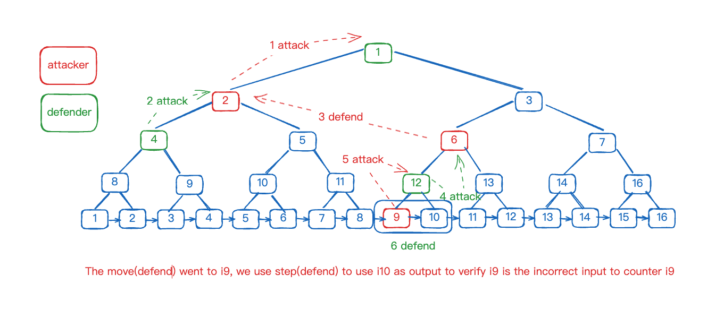

# Fault-Dispute-Game

在本章节中，我们将详细介绍 Fault-Dispute-Game。我们将从设计思路开始，逐步深入到代码层面进行探讨。请注意，某些部分如CANNON虚拟机等将在后续章节单独讲解。

## 提出问题

让我们回顾上一章节中设计的[简易fault proof](https://github.com/joohhnnn/The-book-of-optimism-fault-proof-CN/blob/main/01-what-is-fault-proof.md)，探讨其存在的问题。在阅读本章节后，您应该能够了解到这些问题的解答。

1. 每个 Fault-Dispute-Game 是如何创建的？如何更好地管理这些被创建的游戏？
2. 如何确保不缺乏参与者？考虑到 fault-proof 设计的目的是让任何人都能参与，如何降低技术门槛，吸引第三方或普通人参与？
3. 如何控制整个游戏过程中的消耗？如果每次 fault proof 都需要精细解决，所需的 gas 费用可能超过数百个 ETH，在非极端情况下这是不可接受的。
4. 如何避免某一方退出导致游戏无法继续进行？

## 概念和角色介绍

在 fault proof 中，有许多概念需要提前介绍。我们将以直接易懂的方式进行描述。

### [game-tree](https://github.com/ethereum-optimism/specs/blob/main/specs/fault-proof/stage-one/fault-dispute-game.md#game-tree)

game-tree 是一个关键概念。例如，一个 game-tree X 的根节点代表一批次终点的 L2 区块 state，例如从 L2 区块 N 到 N+X。如果我们需要证明 X state 是正确的，是否需要从 N 区块开始，逐个追踪到 N+X 区块中每笔交易的每个 VM 操作指令？
这里引入`SPLIT_DEPTH`和`MAX_GAME_DEPTH`两个概念。简单来说，在从根节点向下的过程中，颗粒度为区块层的深度为 'SPLIT_DEPTH'；超过此层就需要对 VM 的操作指令进行追踪分析。因此，使用二分查找的方式，game-tree 可视为一颗大的二叉树。业务处理在 'SPLIT_DEPTH' 之后有很大的变化，我们从逻辑上将二叉树拆分为两大部分，如下图所示：



### [Claims](https://github.com/ethereum-optimism/specs/blob/main/specs/fault-proof/stage-one/fault-dispute-game.md#claims)

Claims 可以理解为 L2 交易中某个指令执行后所代表的 state hash，state为MIPS虚拟机的状态，如内存分布，寄存器分布等。

如图所示，为某笔交易第1-16指令的执行流，每个执行都会产生一个新的state hash，即 Claim。

注: Root Claim 比较特殊，Root Claim和旧的Output Hash一致，Output由 stateRoot, messagePasserStorageRoot, latestBlockhash三部分组成

这里引入一个概念 `trace index`。

**trace index**: 是将所有 L2 区块拆开，并将所有交易也拆分为指令，并按执行顺序进行排列的索引。

如图所示，二叉树最下方节点的序号即为 `trace index`，例如节点1、3、7、16的 `trace-index` 都为16。`trace index` 的作用是什么呢？从橙色路线开始的节点1的 `trace index `为16，而红色路线中的节点2的 `trace index` 为8。因此不难理解，为什么橙色路线起点节点1可以作为整个 GAME 的 state root，因为它指向了最后一个指令后的 state root，即最终的 state root。

同时，这也揭示了二分法的精髓，当争议产生时，即表示我们要进行第一次二分，节点2所代表的`trace index`恰好是中点。

### [Fault Proof VM](https://github.com/ethereum-optimism/specs/blob/main/specs/fault-proof/index.md#fault-proof-vm)

我们链上实现的指令虚拟机，例如 CANNON（MIPS虚拟机）。

### [DisputeGameFactory](https://etherscan.io/address/0xe5965Ab5962eDc7477C8520243A95517CD252fA9)

DisputeGameFactory 是用来创建各种不同类型的 dispute games 的入口。它可以被任何人调用，并负责追踪和管理有效的 Game 数据。

### [DelayedWETH](https://github.com/ethereum-optimism/specs/blob/dfa8ea9568b0e35827be763fa8e6a2eeb9d90704/specs/fault-proof/stage-one/bond-incentives.md#delayedweth)

DelayedWETH 是 WETH 的修改版本，主要用于 dispute games 的激励及奖励发放。其存在使整个激励系统更加安全。

### [Game Clock](https://github.com/ethereum-optimism/specs/blob/dfa8ea9568b0e35827be763fa8e6a2eeb9d90704/specs/fault-proof/stage-one/fault-dispute-game.md#game-clock)
Game Clock 类似于象棋中的棋钟概念，双方各有一个倒计时计时器。操作结束后按下计时器，对方的计时器开始倒数。如果在计时器结束前未分出胜负，计时器先结束的一方将被判定为失败。

### [ANCHOR_STATE_REGISTRY](https://etherscan.io/address/0x18DAc71c228D1C32c99489B7323d441E1175e443)
ANCHOR_STATE_REGISTRY 用于存储和管理已经通过 fault proof 验证的 state 数据的合约。

### [Moves](https://github.com/ethereum-optimism/specs/blob/dfa8ea9568b0e35827be763fa8e6a2eeb9d90704/specs/fault-proof/stage-one/honest-challenger-fdg.md#moves)
Moves 分为 Attack 和 Defend，但不必过分纠结这两个概念，我们仍可从二分法的角度理解。传统二分法中，参与角色通常是单一的，评判标准固定。然而，在 Fault Dispute Game (FDG) 中，可能由于双方观点的偏差导致评判标准出现两种。通常我们从“我们”的角度讨论二分法，描述为“通过二分缩小范围”，细分为两个步骤：1. 寻找中点；2. 选择合适的部分。但在 FDG 环境下，如果发生 challenge，表明双方对问题的看法存在分歧，尤其是在第二步中，双方可能会做出不同的选择。例如，“attack”操作可以视为选择左半部分继续进行，而“defend”操作则是选择右半部分继续。

举个简单例子：假设有五个数字 1, 2, 3, 4, 5。正常情况下，这些数字的处理应该不会有问题。但如果挑战者 A 认为数字 4 存在问题，并因此发起 attack，标记为 attack 1，这次攻击会使得数据在数字 3 处被分为两部分：123 和 345。此时，defender B 可能不清楚 A 为何发起攻击，可能会错误地认为 A 认为 123 有误，因此反击 attack 1，称之为 attack 2，认为 123 部分是正确的。实际上，B 的意图是因为数字 4 的问题，所以他维护他的 attack 1，将焦点转移到 345 部分。

### [Step](https://github.com/ethereum-optimism/specs/blob/dfa8ea9568b0e35827be763fa8e6a2eeb9d90704/specs/fault-proof/stage-one/honest-challenger-fdg.md#steps)
在 Moves 运动到 'MAX_GAME_DEPTH' 后的操作，即需要在 'Fault Proof VM' 中进行验证的操作。

### [Resolve](https://github.com/ethereum-optimism/specs/blob/dfa8ea9568b0e35827be763fa8e6a2eeb9d90704/specs/fault-proof/stage-one/honest-challenger-fdg.md#resolution)
分为 ResolveClaim 和 Resolve，当其中一方在 Step 中被成功证明，或者 Game Clock 计时结束，游戏通过 ResolveClaim 和 Resolve 来揭示胜者，进一步分配激励奖金。

## Fault-Proof后的智能合约架构



在这张图示中，我们可以清晰的观察到之前的proposer架构被FaultDisputeGame的架构替代（绿框部分），接下来让我们深入探索这些主要组件的具体细节！

## 工作流程

让我们通过一个实际的流程来串联整个工作流：

1. 用户A通过 'DisputeGameFactory' 创建了 GAME A，存入 bond 资金作为抵押，并声明 Claim 为 B。

    1.1 如果用户A声明的 Claim B 是正确的：
    
    1.1.1 如果没有恶意用户挑战，并且挑战期（棋钟）结束，该 Claim 被 Resolve 标记为有效。
        
    1.1.2 如果用户B挑战，用户A反击，双方不断竞争直到最细颗粒，并通过 step 进行判断。首先需要 op-program 在本地进行模拟，然后上传相关数据至 pre-image-oracle，并通过 step 触发链上的 FPVM-cannon 来判断真实结果。双方都极其消耗 ETH 作为 gas 和保证金，但由于客观上 A 是正确的，他将在最终获胜后拿走 B 的所有保证金，保证金足以弥补 A 的 gas 消耗且收入可观。或者 B 及时意识到错误，放弃进一步攻击，等待棋钟结束，判 A 胜利。

    1.2 如果用户A声明的 Claim B 是错误的：过程同 1.1.2。

## 深入代码中去理解

### 通过 DisputeGameFactory 创建 Game

[Full code link](https://github.com/ethereum-optimism/optimism/blob/d091bb33ceba0931205584d88b8c2bd84404e466/packages/contracts-bedrock/src/dispute/DisputeGameFactory.sol#L84)

```solidity

    function create(
        GameType _gameType,
        Claim _rootClaim,
        bytes calldata _extraData
    )
        external
        payable
        returns (IDisputeGame proxy_)
    {
        …

        proxy_ = IDisputeGame(address(impl).clone(abi.encodePacked(msg.sender, _rootClaim, parentHash, _extraData)));
        proxy_.initialize{ value: msg.value }();

        // Compute the unique identifier for the dispute game.
        Hash uuid = getGameUUID(_gameType, _rootClaim, _extraData);

        // If a dispute game with the same UUID already exists, revert.
        if (GameId.unwrap(_disputeGames[uuid]) != bytes32(0)) revert GameAlreadyExists(uuid);

        // Pack the game ID.
        GameId id = LibGameId.pack(_gameType, Timestamp.wrap(uint64(block.timestamp)), address(proxy_));

        _disputeGames[uuid] = id;
        _disputeGameList.push(id);
    }
```

首先我们先看看三个入参分别代表了什么：
1. `gameType`：代表当前所使用的验证 VM 的方式，当前大部分为 type 0 即 Cannon。

    [game type 0](https://sepolia.etherscan.io/address/0x200b7F3259E1c2F5be6d801339d4E8C3d4534f15#code)：FaultDisputeGame 
    [game type 1](https://sepolia.etherscan.io/address/0xFDcA34EDa4cf5944E9fa0D5DBE2A515a88650FB7#code)：PermissionedDisputeGame

2. `rootClaim`：rootClaim 代表这次游戏证明涉及的 rootClaim，即在旧机制中 proposer 发布到 L1 上的 L2 state root。

3. `extraData`：在 type 0 的情况下，额外数据代表 L2 的区块号。

需要注意的是，这里的 factory 使用了最小代理合约的概念，这样有一个好处是我们可以看到 GAME 的实际合约大小非常小，从而来降低部署费用。如果感兴趣可以查看 [EIP-1167](https://eips.ethereum.org/EIPS/eip-1167)。

我们可以看到每个特定的 Claim Game 只能被创建一次，并且在创建后加入到了 disputeGameList 被统一追踪。

### Game 
`FaultDisputeGame.sol` 合约是 Fault-Dispute-Game 的核心部分，主要实现了 `move`、`step` 和 `resolve` 三个关键操作。

---

#### move()

[Full code link](https://github.com/ethereum-optimism/optimism/blob/78e1084ec14d3003cb9e546b9eb5a22db7408ac2/packages/contracts-bedrock/src/dispute/FaultDisputeGame.sol#L319)

`move()` 函数的主要操作包括：
1. 根据是 `attack` 还是 `defend` 计算出下一个 move 的位置。
2. 确定提交的下一个 claim 数据是否有效，进行特定情况的检查，确保每次 move 的 bond 抵押金正确，并确保计时器正确，重新计算剩余棋钟时间。
3. 将结果保存到 claimData 和 subgame 中以供后续操作使用。

```solidity
    function move(Claim _disputed, uint256 _challengeIndex, Claim _claim, bool _isAttack) public payable virtual {

        ClaimData memory parent = claimData[_challengeIndex];

        //----------part1 start----------
        Position parentPos = parent.position;
        Position nextPosition = parentPos.move(_isAttack);
        uint256 nextPositionDepth = nextPosition.depth();
        //----------part1 end----------
        
        //----------part2 start----------
        if (getRequiredBond(nextPosition) != msg.value) revert IncorrectBondAmount();

        if (nextDuration.raw() == MAX_CLOCK_DURATION.raw()) revert ClockTimeExceeded();

        if (nextDuration.raw() > MAX_CLOCK_DURATION.raw() - CLOCK_EXTENSION.raw()) {

        Clock nextClock = LibClock.wrap(nextDuration, Timestamp.wrap(uint64(block.timestamp)));
        //----------part2 end----------

        //----------part3 start----------
        claimData.push(
            ClaimData({
                parentIndex: uint32(_challengeIndex),
                // This is updated during subgame resolution
                counteredBy: address(0),
                claimant: msg.sender,
                bond: uint128(msg.value),
                claim: _claim,
                position: nextPosition,
                clock: nextClock
            })
        );

        // Update the subgame rooted at the parent claim.
        subgames[_challengeIndex].push(claimData.length - 1);

        // Deposit the bond.
        WETH.deposit{ value: msg.value }();
        //----------part3 end----------

    }
```

---

#### step()
`step()` 函数在 `move()` 进行到 `MAX_GAME_DEPTH` 时被调用，需要链上 VM 如 **cannon** 进行介入的步骤。

此过程是双方完成共识的关键步骤，step 是这个共识过程的最终环节。

**attack**: 攻击方提供被反驳节点的前一个节点作为输入，正向推导出结果与被反驳节点进行比较，以验证被反驳节点是错误的。



attack在此仅有一种情况：双方都在instruction 8处达到了共识（*注:缩写'I'将在文章内替代'instruction'*），对 I 9 的有效性产生分歧，从 I 8 开始推导以验证 I 9 是否有效。用直白的话来说，就是："你提供了一份材料，我根据这份材料推导出来的结果与你的断言不符，我们对这个过程进行验证。如果你的材料无法推导出你的断言，那么你的断言无效。"


**defend**: 防御方提供输出，反向推导反驳目标作为输入来验证反驳目标是错误的。



防御通过验证被反驳的 I 9 右侧的 I 10 是否有效来进行反驳。这里有两种情况：
1. I 10 的 claim 数据来自提出 I 9 的对手方，即 I 9 和 I 10 持相反意见，要验证 I 10 作为输出是有效的。
2. I 10 的 claim 数据来自提出 I 9 的提出方，即 I 9 和 I 10 持相同意见，需要证明 I 10 是无效的。


执行流程：
- 对于 attack，以数据源 I 8 在 VM 中执行，将结果与 I 9 进行比较，完成反驳。
- 对于 defend，验证被反驳的 I 9 右侧的 I 10 是否有效进行反驳。这可能涉及到验证 I 10 的 claim 数据来源，以确认其有效性或推导出反驳 I 9 的内容，从而完成反驳过程。

##### code：
[Full code link](https://github.com/ethereum-optimism/optimism/blob/78e1084ec14d3003cb9e546b9eb5a22db7408ac2/packages/contracts-bedrock/src/dispute/FaultDisputeGame.sol#L234)

主要操作包括：
1. 判断操作是 attack 还是 defend，根据 trace index 从 DAG 中找到相应数据，并进行 prestate 和 poststate 的初始化。
2. 在 VM 中执行以判断有效性，并在 defend 情况下确定具体属于哪种情况。
3. 如果反驳成功，则记录数据。

```solidity
function step(
    uint256 _claimIndex,
    bool _isAttack,
    bytes calldata _stateData,
    bytes calldata _proof
)
    public
    virtual
{

    ClaimData storage parent = claimData[_claimIndex];

    Position parentPos = parent.position;
    Position stepPos = parentPos.move(_isAttack);

    // Determine the expected pre & post states of the step.
    Claim preStateClaim;
    ClaimData storage postState;
    
    //----------part1 start----------
    if (_isAttack) {
        preStateClaim = (stepPos.indexAtDepth() % (1 << (MAX_GAME_DEPTH - SPLIT_DEPTH))) == 0
            ? ABSOLUTE_PRESTATE
            : _findTraceAncestor(Position.wrap(parentPos.raw() - 1), parent.parentIndex, false).claim;
        postState = parent;
    } else {
        preStateClaim = parent.claim;
        postState = _findTraceAncestor(Position.wrap(parentPos.raw() + 1), parent.parentIndex, false);
    }
    //----------part1 end----------
    
    if (keccak256(_stateData) << 8 != preStateClaim.raw() << 8) revert InvalidPrestate();

    // Compute the local preimage context for the step.
    Hash uuid = _findLocalContext(_claimIndex);
    //----------part2 start----------
    bool validStep = VM.step(_stateData, _proof, uuid.raw()) == postState.claim.raw();
    bool parentPostAgree = (parentPos.depth() - postState.position.depth()) % 2 == 0;
    //----------part2 end----------
    
    //----------part3 start----------
    if (parentPostAgree == validStep) revert ValidStep();

    parent.counteredBy = msg.sender;
    //----------part3 end----------
}
```

#### resolveClaim() & resolve()
[Full code link for resolveClaim()](https://github.com/ethereum-optimism/optimism/blob/78e1084ec14d3003cb9e546b9eb5a22db7408ac2/packages/contracts-bedrock/src/dispute/FaultDisputeGame.sol#L560) ：resolveClaim负责将一个claim下的所有子游戏进行单个完结，和对整个claim进行完结
[Full code link for resolve()](https://github.com/ethereum-optimism/optimism/blob/78e1084ec14d3003cb9e546b9eb5a22db7408ac2/packages/contracts-bedrock/src/dispute/FaultDisputeGame.sol#L541) ：resolve负责在所有子游戏都结束后，对整个game进行完结


---


resolveClaim的操作需要分两种情况：

- 处理子游戏，入参`_numToResolve` 为 0。
    1. 判断是当前棋钟是否已经耗尽
    ```solidity
        if (challengeClockDuration.raw() < MAX_CLOCK_DURATION.raw()) revert ClockNotExpired();
    ```
    2. 判断否为最细粒度的子游戏，如果是，将支付的bond计入反驳成功者的账户，同时将子游戏记做已解决，并返回。
    ```solidity
        if (challengeIndicesLen == 0 && _claimIndex != 0) {
            address counteredBy = subgameRootClaim.counteredBy;
            address recipient = counteredBy == address(0) ? subgameRootClaim.claimant : counteredBy;
            _distributeBond(recipient, subgameRootClaim);
            resolvedSubgames[_claimIndex] = true;
            return;
        }
    ```


- 处理主claim，入参`_numToResolve` 为单次transaction中需要验证的subgame的数量，每次操作处理的subgame数量之和需等于总subgame数量。

    1. 判断是当前棋钟是否已经耗尽

    ```solidity
        if (challengeClockDuration.raw() < MAX_CLOCK_DURATION.raw()) revert ClockNotExpired();
    ```

    2. 判断当前claim是否首次被执行resolveClaim，如果是，创建并初始化checkpoint以应对多次transaction共同完成resolveClaim的情况。
    ```solidity
        // If the checkpoint does not currently exist, initialize the current left most position as max u128.
        if (!checkpoint.initialCheckpointComplete) {
            checkpoint.leftmostPosition = Position.wrap(type(uint128).max);
            checkpoint.initialCheckpointComplete = true;

            if (_numToResolve == 0) _numToResolve = challengeIndicesLen;
        }
    ```
    3. 循环校验子任务是否全部解决，并在循环中确保[最左边的索取激励](https://github.com/ethereum-optimism/specs/blob/dfa8ea9568b0e35827be763fa8e6a2eeb9d90704/specs/fault-proof/stage-one/bond-incentives.md#leftmost-claim-incentives)。

    ```solidity
        uint256 lastToResolve = checkpoint.subgameIndex + _numToResolve;
        uint256 finalCursor = lastToResolve > challengeIndicesLen ? challengeIndicesLen : lastToResolve;
        for (uint256 i = checkpoint.subgameIndex; i < finalCursor; i++) {
            uint256 challengeIndex = challengeIndices[i];

            // INVARIANT: Cannot resolve a subgame containing an unresolved claim
            if (!resolvedSubgames[challengeIndex]) revert OutOfOrderResolution();

            ClaimData storage claim = claimData[challengeIndex];

            // If the child subgame is uncountered and further left than the current left-most counter,
            // update the parent subgame's `countered` address and the current `leftmostCounter`.
            // The left-most correct counter is preferred in bond payouts in order to discourage attackers
            // from countering invalid subgame roots via an invalid defense position. As such positions
            // cannot be correctly countered.
            // Note that correctly positioned defense, but invalid claimes can still be successfully countered.
            if (claim.counteredBy == address(0) && checkpoint.leftmostPosition.raw() > claim.position.raw()) {
                checkpoint.counteredBy = claim.claimant;
                checkpoint.leftmostPosition = claim.position;
            }
        }
    ```
    
    4. 如果claim没有未结局的子游戏，根据当前claim的反驳状态来确定反驳者,并分发bond奖励。

    ```solidity
        // Increase the checkpoint's cursor position by the number of children that were checked.
        checkpoint.subgameIndex = uint32(finalCursor);

        // Persist the checkpoint and allow for continuing in a separate transaction, if resolution is not already
        // complete.
        resolutionCheckpoints[_claimIndex] = checkpoint;

        // If all children have been traversed in the above loop, the subgame may be resolved. Otherwise, persist the
        // checkpoint and allow for continuation in a separate transaction.
        if (checkpoint.subgameIndex == challengeIndicesLen) {
            address countered = checkpoint.counteredBy;

            // Mark the subgame as resolved.
            resolvedSubgames[_claimIndex] = true;

            // Distribute the bond to the appropriate party.
            if (_claimIndex == 0 && l2BlockNumberChallenged) {
                // Special case: If the root claim has been challenged with the `challengeRootL2Block` function,
                // the bond is always paid out to the issuer of that challenge.
                address challenger = l2BlockNumberChallenger;
                _distributeBond(challenger, subgameRootClaim);
                subgameRootClaim.counteredBy = challenger;
            } else {
                // If the parent was not successfully countered, pay out the parent's bond to the claimant.
                // If the parent was successfully countered, pay out the parent's bond to the challenger.
                _distributeBond(countered == address(0) ? subgameRootClaim.claimant : countered, subgameRootClaim);

                // Once a subgame is resolved, we percolate the result up the DAG so subsequent calls to
                // resolveClaim will not need to traverse this subgame.
                subgameRootClaim.counteredBy = countered;
            }
        }
    ```


resolve：

1. 验证解决状态，并更新全局状态
2. 更新ANCHOR_STATE_REGISTRY中L2的最新l2BlockNumber和root hash。

```solidity
    function resolve() external returns (GameStatus status_) {
        // INVARIANT: Resolution cannot occur unless the game is currently in progress.
        if (status != GameStatus.IN_PROGRESS) revert GameNotInProgress();

        // INVARIANT: Resolution cannot occur unless the absolute root subgame has been resolved.
        if (!resolvedSubgames[0]) revert OutOfOrderResolution();

        // Update the global game status; The dispute has concluded.
        status_ = claimData[0].counteredBy == address(0) ? GameStatus.DEFENDER_WINS : GameStatus.CHALLENGER_WINS;
        resolvedAt = Timestamp.wrap(uint64(block.timestamp));

        // Update the status and emit the resolved event, note that we're performing an assignment here.
        emit Resolved(status = status_);

        // Try to update the anchor state, this should not revert.
        ANCHOR_STATE_REGISTRY.tryUpdateAnchorState();
    }
```

## 总结

以上内容涵盖了整个 Fault Dispute Game 链上合约的核心部分。在这一章节中，我们详细介绍了合约中的主要操作如 move、step 和 resolve，并且通过具体的代码片段深入了解了这些操作的实现逻辑。

值得注意的是，我们还未对链上虚拟机（MIPS）进行详细的探讨。链上 VM 的具体细节和工作原理将在下一章节详细讲解，届时我们将深入了解其在 Fault Dispute Game 中的具体应用和重要性。