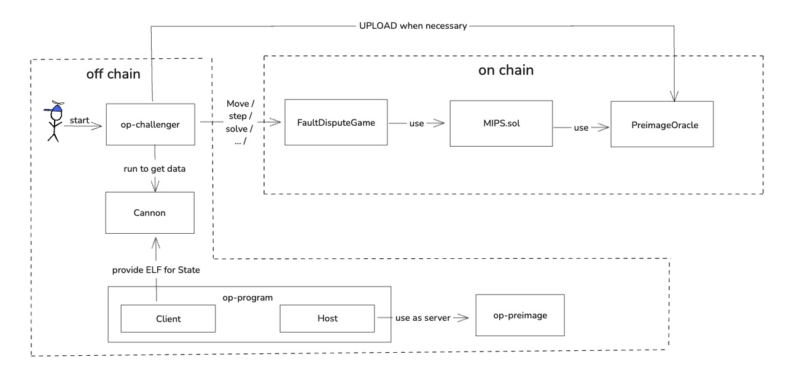

# op-challenger

op-challenger 主要负责操作 FDG (Fault Dispute Game)，它通过直接使用 Cannon、op-program 等组件来维持整个 FDG 的正常执行。



我们将 op-challenger 分为两部分：

- 监控（monitor）：监控游戏进程，并做出相应操作。
- 执行子任务，如 step、move、upload preimage 等。

## 监控 (monitor)
monitor 组件负责订阅 L1 上的区块。每当有新的区块生成时，它会检索所有游戏，查看是否需要分配并执行具体操作。

### 启动监控
使用 [StartMonitoring()](https://github.com/ethereum-optimism/optimism/blob/develop/op-challenger/game/monitor.go#L152) 函数启动监控。`onNewL1Head()` 函数作为回调参数传入 `resubscribeFunction()`，并最终注册到 `eth.WatchHeadChanges` 中。
每 10 秒钟检索一次，当检索到新区块后，将该区块的哈希和区块号传入 `progressGames()` 进行处理。

```

func (m *gameMonitor) onNewL1Head(ctx context.Context, sig eth.L1BlockRef) {
	m.clock.SetTime(sig.Time)
	if err := m.progressGames(ctx, sig.Hash, sig.Number); err != nil {
		m.logger.Error("Failed to progress games", "err", err)
	}
	if err := m.preimages.Schedule(sig.Hash, sig.Number); err != nil {
		m.logger.Error("Failed to validate large preimages", "err", err)
	}
}

func (m *gameMonitor) resubscribeFunction() event.ResubscribeErrFunc {
	// The ctx is cancelled as soon as the subscription is returned,
	// but is only used to create the subscription, and does not affect the returned subscription.
	return func(ctx context.Context, err error) (event.Subscription, error) {
		if err != nil {
			m.logger.Warn("resubscribing after failed L1 subscription", "err", err)
		}
		return eth.WatchHeadChanges(ctx, m.l1Source, m.onNewL1Head)
	}
}

func (m *gameMonitor) StartMonitoring() {
	m.runState.Lock()
	defer m.runState.Unlock()
	if m.l1HeadsSub != nil {
		return // already started
	}
	m.l1HeadsSub = event.ResubscribeErr(time.Second*10, m.resubscribeFunction())
}
```

### 分配子任务

[progressGames](https://github.com/ethereum-optimism/optimism/blob/f940301caf531996eee4172e710b0decb7b78dde/op-challenger/game/monitor.go#L106) 函数在监听到新的区块后执行，其主要作用是获取所有有效的 game，并将这些 game 传入 Schedule 中用于后续的任务派发。需要注意的是，schedule 分为多个类别，如 bondSchedule（用于管理 claim 对应的 bond）和 pre-image schedule（用于上传 pre-image 数据）。我们在这里仅针对最基础的 move 和 step 的 schedule 进行讲解。

```
func (m *gameMonitor) progressGames(ctx context.Context, blockHash common.Hash, blockNumber uint64) error {
	minGameTimestamp := clock.MinCheckedTimestamp(m.clock, m.gameWindow)
	games, err := m.source.GetGamesAtOrAfter(ctx, blockHash, minGameTimestamp)
	if err != nil {
		return fmt.Errorf("failed to load games: %w", err)
	}
	var gamesToPlay []types.GameMetadata
	for _, game := range games {
		if !m.allowedGame(game.Proxy) {
			m.logger.Debug("Skipping game not on allow list", "game", game.Proxy)
			continue
		}
		gamesToPlay = append(gamesToPlay, game)
	}
	if err := m.claimer.Schedule(blockNumber, gamesToPlay); err != nil {
		return fmt.Errorf("failed to schedule bond claims: %w", err)
	}
	if err := m.scheduler.Schedule(gamesToPlay, blockNumber); errors.Is(err, scheduler.ErrBusy) {
		m.logger.Info("Scheduler still busy with previous update")
	} else if err != nil {
		return fmt.Errorf("failed to schedule games: %w", err)
	}
	return nil
}
```


[schedule()](https://github.com/ethereum-optimism/optimism/blob/f940301caf531996eee4172e710b0decb7b78dde/op-challenger/game/scheduler/coordinator.go#L60) 函数处理接收到的 game，并在 createJob 中判断 game 是否需要新的子操作，然后通过 enqueueJob 函数将所有的子操作添加到 jobQueue 中进行传递。

```
func (c *coordinator) schedule(ctx context.Context, games []types.GameMetadata, blockNumber uint64) error {
    
        ……
        
	// Next collect all the jobs to schedule and ensure all games are recorded in the states map.
	// Otherwise, results may start being processed before all games are recorded, resulting in existing
	// data directories potentially being deleted for games that are required.
	for _, game := range games {
		if j, err := c.createJob(ctx, game, blockNumber); err != nil {
			errs = append(errs, fmt.Errorf("failed to create job for game %v: %w", game.Proxy, err))
		} else if j != nil {
			jobs = append(jobs, *j)
			c.m.RecordGameUpdateScheduled()
		}
	}
    
        ……
        
	// Finally, enqueue the jobs
	for _, j := range jobs {
		if err := c.enqueueJob(ctx, j); err != nil {
			errs = append(errs, fmt.Errorf("failed to enqueue job for game %v: %w", j.addr, err))
		}
	}
	return errors.Join(errs...)
}
```

## 子任务的执行操作

### 生成 action
当 jobQueue 中出现数据后，需要在 [CalculateNextActions()](https://github.com/ethereum-optimism/optimism/blob/f940301caf531996eee4172e710b0decb7b78dde/op-challenger/game/fault/solver/game_solver.go#L26) 中将这些子任务信号转化为具体的 action。以 step 操作为例，当 game depth 达到 MaxDepth 时，我们会生成对应 step 的 action。

```
func (s *GameSolver) CalculateNextActions(ctx context.Context, game types.Game) ([]types.Action, error) {

        ……
	var actions []types.Action
	agreedClaims := newHonestClaimTracker()

	for _, claim := range game.Claims() {
		var action *types.Action
		if claim.Depth() == game.MaxDepth() {
			action, err = s.calculateStep(ctx, game, claim, agreedClaims)
		} else {
			action, err = s.calculateMove(ctx, game, claim, agreedClaims)
		}
        ……
		if action == nil {
			continue
		}
		actions = append(actions, *action)
	}
	return actions, nil
}
```
```
func (s *GameSolver) calculateStep(ctx context.Context, game types.Game, claim types.Claim, agreedClaims *honestClaimTracker) (*types.Action, error) {
	if claim.CounteredBy != (common.Address{}) {
		return nil, nil
	}
	step, err := s.claimSolver.AttemptStep(ctx, game, claim, agreedClaims)
	if err != nil {
		return nil, err
	}
	if step == nil {
		return nil, nil
	}
	return &types.Action{
		Type:        types.ActionTypeStep,
		ParentClaim: step.LeafClaim,
		IsAttack:    step.IsAttack,
		PreState:    step.PreState,
		ProofData:   step.ProofData,
		OracleData:  step.OracleData,
	}, nil
}
```

```
func (s *claimSolver) AttemptStep(ctx context.Context, game types.Game, claim types.Claim, honestClaims *honestClaimTracker) (*StepData, error) {

        ……
	preState, proofData, oracleData, err := s.trace.GetStepData(ctx, game, claim, position)
	if err != nil {
		return nil, err
	}

	return &StepData{
		LeafClaim:  claim,
		IsAttack:   !claimCorrect,
		PreState:   preState,
		ProofData:  proofData,
		OracleData: oracleData,
	}, nil
}
```

`GetStepData()` 函数间接调用了 [DoGenerateProof()](https://github.com/ethereum-optimism/optimism/blob/develop/op-challenger/game/fault/trace/vm/executor.go#L74) 函数，启动了 Cannon 以生成 step 所需的 state data 和 proof data。

```
func (e *Executor) DoGenerateProof(ctx context.Context, dir string, begin uint64, end uint64, extraVmArgs ...string) error {
        ……
	args := []string{
		"run",
		"--input", start,
		"--output", lastGeneratedState,
		"--meta", "",
		"--info-at", "%" + strconv.FormatUint(uint64(e.cfg.InfoFreq), 10),
		"--proof-at", "=" + strconv.FormatUint(end, 10),
		"--proof-fmt", filepath.Join(proofDir, "%d.json.gz"),
		"--snapshot-at", "%" + strconv.FormatUint(uint64(e.cfg.SnapshotFreq), 10),
		"--snapshot-fmt", filepath.Join(snapshotDir, "%d.json.gz"),
	}
	if end < math.MaxUint64 {
		args = append(args, "--stop-at", "="+strconv.FormatUint(end+1, 10))
	}
	if e.cfg.DebugInfo {
		args = append(args, "--debug-info", filepath.Join(dataDir, debugFilename))
	}
	args = append(args, extraVmArgs...)
	args = append(args,
		"--",
		e.cfg.Server, "--server",
		"--l1", e.cfg.L1,
		"--l1.beacon", e.cfg.L1Beacon,
		"--l2", e.cfg.L2,
		"--datadir", dataDir,
		"--l1.head", e.inputs.L1Head.Hex(),
		"--l2.head", e.inputs.L2Head.Hex(),
		"--l2.outputroot", e.inputs.L2OutputRoot.Hex(),
		"--l2.claim", e.inputs.L2Claim.Hex(),
		"--l2.blocknumber", e.inputs.L2BlockNumber.Text(10),
	)
        ……
	err = e.cmdExecutor(ctx, e.logger.New("proof", end), e.cfg.VmBin, args...)
        ……
	return err
}
```

### 执行 action
在 [PerformAction()](https://github.com/ethereum-optimism/optimism/blob/f940301caf531996eee4172e710b0decb7b78dde/op-challenger/game/fault/responder/responder.go#L90) 中执行获取到的 action。此函数根据 action 的类别进行判断并执行相应的上链操作：

- 判断是否需要上传 Pre-image data。
- 判断操作类型是否为 Attack/Defend。
- 判断是否为 Step 操作。
- 判断是否可以从 L2BlockNumber 角度否定 root claim。
```
func (r *FaultResponder) PerformAction(ctx context.Context, action types.Action) error {
	if action.OracleData != nil {
		var preimageExists bool
		var err error
		if !action.OracleData.IsLocal {
			preimageExists, err = r.oracle.GlobalDataExists(ctx, action.OracleData)
			if err != nil {
				return fmt.Errorf("failed to check if preimage exists: %w", err)
			}
		}
		// Always upload local preimages
		if !preimageExists {
			err := r.uploader.UploadPreimage(ctx, uint64(action.ParentClaim.ContractIndex), action.OracleData)
			if errors.Is(err, preimages.ErrChallengePeriodNotOver) {
				r.log.Debug("Large Preimage Squeeze failed, challenge period not over")
				return nil
			} else if err != nil {
				return fmt.Errorf("failed to upload preimage: %w", err)
			}
		}
	}
	var candidate txmgr.TxCandidate
	var err error
	switch action.Type {
	case types.ActionTypeMove:
		if action.IsAttack {
			candidate, err = r.contract.AttackTx(ctx, action.ParentClaim, action.Value)
		} else {
			candidate, err = r.contract.DefendTx(ctx, action.ParentClaim, action.Value)
		}
	case types.ActionTypeStep:
		candidate, err = r.contract.StepTx(uint64(action.ParentClaim.ContractIndex), action.IsAttack, action.PreState, action.ProofData)
	case types.ActionTypeChallengeL2BlockNumber:
		candidate, err = r.contract.ChallengeL2BlockNumberTx(action.InvalidL2BlockNumberChallenge)
	}
	if err != nil {
		return err
	}
	return r.sender.SendAndWaitSimple("perform action", candidate)
}
```

## 总结

op-challenger 是一个为Fault proof设计的高度自动化系统，旨在实时监控和响应链上游戏状态的变化。通过持续监听区块链事件，并根据游戏状态动态执行攻击或防御操作，op-challenger 提供了一个策略性强、反应迅速的解决方案。该系统与 cannon op-program 等关键组件紧密集成，能够自动化地生成游戏步骤所需的数据输入，并确保游戏决策的准确执行。
